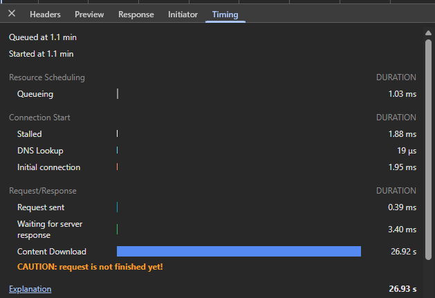

# Python Streams

A hands-on exploration of streaming in Python — from raw TCP sockets to async I/O, HTTP chunked transfer, and beyond.

## What is a Stream?

A **stream** is a sequence of data delivered incrementally over time rather than all at once. Instead of waiting for a complete response, the receiver processes each chunk as it arrives. This matters for:

- Large data (files, logs, media) where buffering everything wastes memory
- Real-time feeds (live prices, sensor data, LLM tokens) where latency matters
- Long-running responses (progress updates, server-sent events)

## Concepts Covered

| Concept | Description |
|---|---|
| `asyncio` streams | Python's built-in async TCP primitives (`StreamReader` / `StreamWriter`) |
| HTTP chunked transfer | Sending an HTTP response in pieces without knowing the total length upfront |
| Backpressure | Slowing producers when consumers can't keep up (`drain()`) |

## Examples

### `http_chunked_stream.py` — Chunked HTTP server from scratch

Builds a bare-metal HTTP/1.1 server using only `asyncio.start_server`. Demonstrates:

- Parsing a raw HTTP request
- Responding with `Transfer-Encoding: chunked` so the browser receives lines as they're produced
- Using `writer.drain()` to respect TCP backpressure

**Run it:**

```bash
python http_chunked_stream.py
```

Then open your browser at `http://127.0.0.1:8888` and watch lines appear one per second.

Or use `curl` to see the raw chunks:

```bash
curl -N http://127.0.0.1:8888
```

Override the port if 8888 is taken:

```bash
PORT=9000 python http_chunked_stream.py
```

---

### `terminal_broadcast.py` — Live terminal-to-browser stream

Keeps HTTP connections open indefinitely and broadcasts whatever you type in the terminal to all connected browser tabs in real time. Demonstrates:

- Persistent connections with no closing chunk
- Detecting client disconnect via `reader.read()` returning `b""`
- Running blocking `input()` on a thread pool with `run_in_executor` so the event loop stays free
- Broadcasting one message to multiple simultaneous clients

### `run_in_executor` — mixing blocking code with async

`input()` is a blocking call: it freezes the entire thread until you press Enter. Since the asyncio event loop runs on one thread, calling it directly would pause every connected client while waiting for a keystroke.

`run_in_executor` fixes this by offloading the blocking call to a background thread, then `await`-ing a future that resolves when that thread finishes:

```python
line = await loop.run_in_executor(None, input, "> ")
#                                 ^     ^       ^
#                                 |     |       argument passed to input()
#                                 |     blocking function to run on the thread
#                                 None = use the default ThreadPoolExecutor
```

The event loop stays free to serve chunks to browsers while the thread sits blocked on the keyboard. The pattern works for any blocking call — slow libraries, legacy file I/O, etc.:

```python
result = await loop.run_in_executor(None, some_blocking_function, arg1, arg2)
```

**Run it:**

```bash
python terminal_broadcast.py
```

1. Open `http://127.0.0.1:8888` in one or more browser tabs
2. Type a message in the terminal and press Enter
3. The message appears in every connected tab instantly

```bash
PORT=9000 python terminal_broadcast.py
```

### What it looks like in DevTools

Open Chrome DevTools → Network tab, click the request, go to **Timing**:



| Phase | What it means |
|---|---|
| **DNS Lookup / Initial connection** | Normal TCP handshake to localhost — completes in ~2 ms |
| **Waiting for server response** | Time until the first byte arrived (headers + padding chunk) — 3.4 ms here |
| **Content Download** | The open connection receiving chunks — grows for as long as you stay connected |
| **"request is not finished yet"** | Chrome warning that the response has no `Content-Length` and no terminating `0` chunk, so the download phase never closes |

The key insight: in a normal HTTP request, **Content Download** ends in milliseconds. Here it runs for the entire lifetime of the connection — 26 seconds and counting in the screenshot above. That blue bar *is* the stream.

Compare this to `http_chunked_stream.py`: it sends `0\r\n\r\n` after 10 lines, so Content Download ends cleanly and the warning disappears.

## How Chunked Transfer Encoding Works

```
HTTP/1.1 200 OK
Transfer-Encoding: chunked

1a\r\n          ← chunk size in hex (26 bytes)
Line 0 at 12:00:00\n\r\n
1a\r\n
Line 1 at 12:00:01\n\r\n
...
0\r\n\r\n       ← zero-length chunk = end of body
```

Each chunk is prefixed with its byte length in hexadecimal. A `0` chunk terminates the stream.

## Requirements

- Python 3.10+
- No third-party dependencies

## License

MIT
